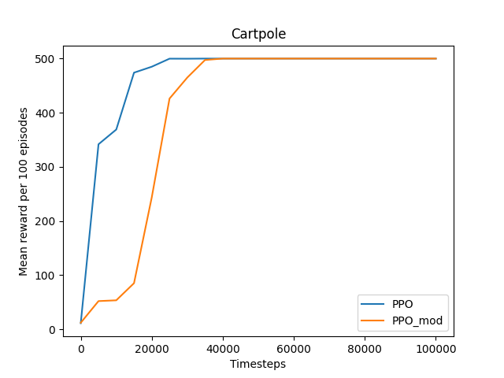

# Gym's Cartpole PPO Evaluation (Discrete vs Continuous)

Training [Stable Baselines PPO](https://stable-baselines3.readthedocs.io/en/master/modules/ppo.html) model on [Gym's Cartpole](https://www.gymlibrary.dev/environments/classic_control/cart_pole/) environment. The initial environment implementation was the discrete action space of left/right moves with a constant force. To update the action space to be continuous the force could have any magnitude between 0 and 10, as well as the discrete movement of left or right.

Results of training:
